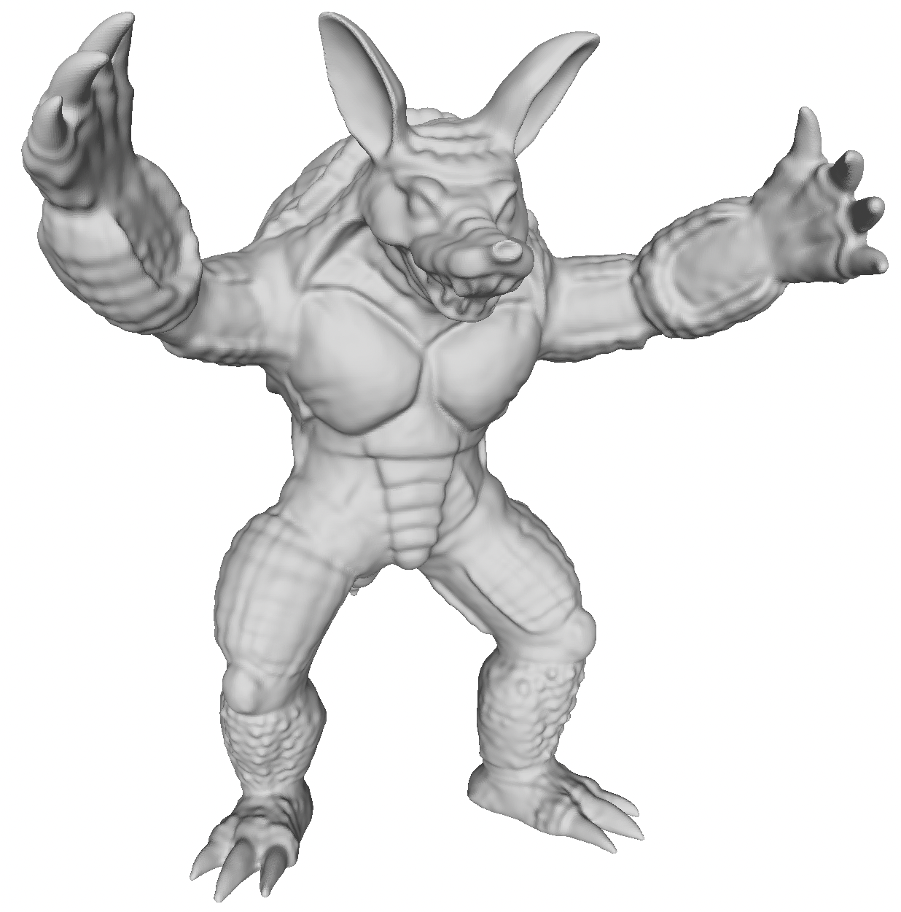
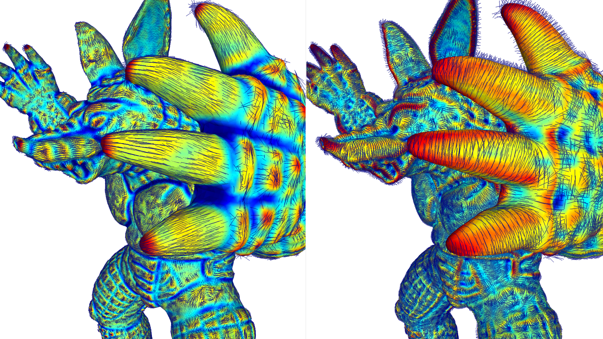
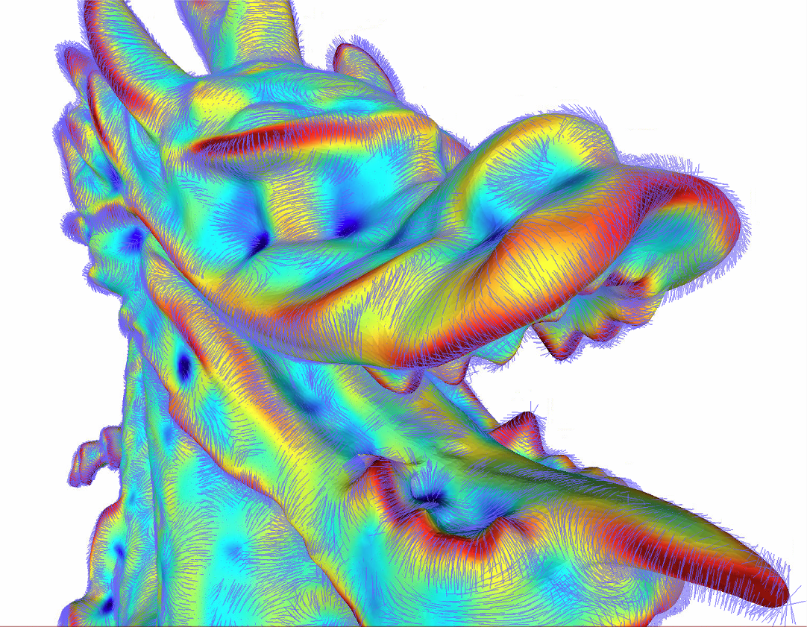

# Exploring Differential Geometry in Neural Implicits
[Tiago Novello [1]](https://sites.google.com/site/tiagonovellodebrito),
[Guilherme Schardong [3]](https://schardong.github.io/),
[Luiz Schirmer [3]](https://www.lschirmer.com),
[Vinícius da Silva [2]](https://dsilvavinicius.github.io/),
[Hélio Lopes [2]](http://www-di.inf.puc-rio.br/~lopes/),
[Luiz Velho [1]](https://lvelho.impa.br/)
<br>
[1] Institute for Pure and Applied Mathematics (IMPA),
[2] Pontifical Catholic University of Rio de Janeiro (PUC-Rio),
[3] University of Coimbra (UC)

This is the official implementation of "Exploring Differential Geometry in Neural Implicits".


## Get started

### Prerequisites
1. [Anaconda](https://www.anaconda.com/products/individual#Downloads), alternativelly you can use [PyEnv](https://github.com/pyenv/pyenv) and [PyEnv-VirtualEnv](https://github.com/pyenv/pyenv-virtualenv) on UNIX based/like systems
2. [Git](https://git-scm.com/download)
3. [Integrate Git Bash with conda](https://discuss.codecademy.com/t/setting-up-conda-in-git-bash/534473) (If on Windows)
4. [MeshLab](https://www.meshlab.net/)

### Code organization
* `dataset.py` - contains the sampling and data classes
* `diff_operators.py` - implementation of differential operators (gradient, hessian, jacobian, curvatures)
* `loss_functions.py` - contains loss functions for different experimental settings
* `main.py` - main function and point-of-entry to our code
* `meshing.py` - mesh creation through marching cubes
* `model.py` - network and layers implementations
* `util.py` - miscelaneous functions and utilities

Additionally, under the `experiment_scripts` folder, there are three scripts with experiments and other auxiliary code that is generally independent of the main code.

* `comparison_analytic.py` - comparison experiments of RBF, SIREN and our approach for analytic models of a sphere and torus
* `comparison_ply.py` - comparison experiments of RBF, SIREN and our approach for PLY models
* `mesh2sdf_open3d_performance_test.py` - performance test using SDF querying implemented in mesh2sdf and open3d. _Not used in the paper_, only testing if it was worth replacing the sampling code implemented using mesh2sdf with open3d.

In the `tools` folder, there are two scripts:

* `estimate_mesh_curvatures.py`: Given a trained model (pth) and the original mesh, we estimate the vertex curvatures using the trained model.
* `reconstruct.py`: Given a trained model (pth) reconstructs the mesh using marching cubes.

### Setup and sample run

1. Open a terminal (or Git Bash if using Windows)
2. Clone the repository: `git clone git@github.com:dsilvavinicius/differential_geometry_in_neural_implicits.git i3d`.
3. Enter project folder: `cd i3d`.
4. Create the environment and setup project dependencies:
```
conda env create -f environment.yml
conda activate i3d
pip install -e .
```
or, if using pyenv (with pyenv-virtualenv):
```
pyenv virtualenv 3.9.9 i3d
pyenv local i3d
pip install -r requirements
pip install -e .
```
5. Download the datasets (available [here](https://drive.google.com/file/d/1MxG9nwiuCS6z9vo59NF93brw5DFYflMl/view?usp=sharing)) and extract them into the `data` folder of the repository
6. Train a network for the armadillo mesh:
```
python main.py experiments/armadillo_curvature_batch_sdf.json
```
7. The results will be stored in `results/armadillo_biased_curvatures_sdf`.
8. To visualize the output mesh by opening the output PLY using MeshLab:
```
meshlab results/armadillo_biased_curvatures_sdf/reconstructions/model_best.ply
```

### End Result

If everything works, MeshLab should show the following image (or an image similar to it):



### Linux

We tested the build steps stated above on Ubuntu 20.04. The prerequisites and setup remain the same, since all packages are available for both systems. We also provide a ```Makefile``` to cover the data download and network training and visualization (steps 5 through 8) above.

### Running on a headless server

If you are training your model in a remote server with no graphical environment, you will probably end up with the following error: `pyglet.canvas.xlib.NoSuchDisplayException: Cannot connect to "None"`. This will happen during the sampling step when loading a mesh. Basically, this means that pyglet needs a graphical display, which does not exist. You can work around this error by creating a virtual framebuffer, which can be done by prepending your python command with: `xvfb-run -s "-screen 0 1400x900x24"`, as in:

```{sh}
xvfb-run -s "-screen 0 1400x900x24" python main.py experiments/armadillo_sdf.json
```

## Citation
If you find our work useful in your research, please cite:
```
@article{novello:i3d:2022,
  title = {Exploring differential geometry in neural implicits},
  journal = {Computers & Graphics},
  volume = {108},
  pages = {49-60},
  year = {2022},
  issn = {0097-8493},
  doi = {https://doi.org/10.1016/j.cag.2022.09.003},
  url = {https://www.sciencedirect.com/science/article/pii/S0097849322001649},
  author = {Tiago Novello and Guilherme Schardong and Luiz Schirmer and Vinícius {da Silva} and Hélio Lopes and Luiz Velho},
  keywords = {Implicit surfaces, Neural Implicits, Neural Networks, Curvatures},
}
```

## Contributors
Besides the paper authors, we list other contributors below. Thank you for helping make our code better!

[DavidXu-JJ](https://github.com/DavidXu-JJ) - Handling the `U=W=0` case on `diff_operators.principal_directions`

## Contact
If you have any questions, please feel free to email the authors, or open an issue.

## Other examples

Principal curvatures and directions overlaid on the Armadillo.


Maximum curvature and corresponding direction on the Stanford Dragon.
